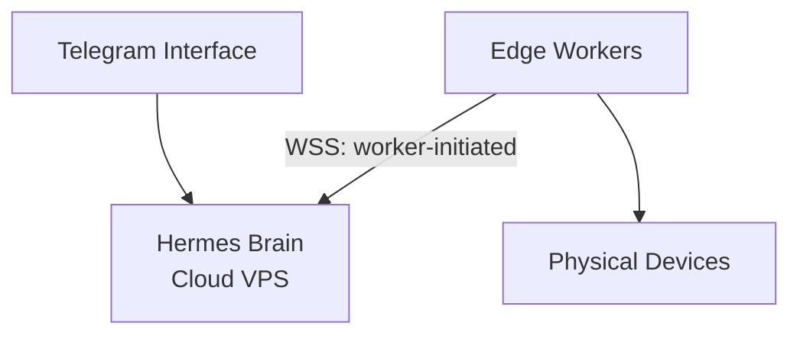
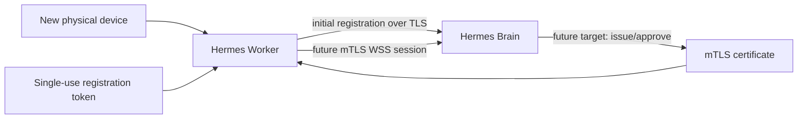

# HermesOS Architecture

## Genel Mimari

HermesOS dağıtık bir ajan mimarisine sahiptir.

Temel prensip:

- Hermes Brain karar verir.
- Worker cihazlar işleri yapar.
- Cihazlar kontrollü yetkilere sahiptir.

---

## İlk Basit Diyagram



## Worker Enrollment and Trust



İlk kayıt token ile yapılır; kalıcı bağlantı güvenliği için hedef mimari mTLS'tir.
Ayrıntı için [[adr/ADR-009-Worker-Enrollment-and-mTLS-Migration|ADR-009]].

---

## Ana Katmanlar

### 1. Interface Layer

Kullanıcı giriş noktaları:

- Telegram
- Web UI
- API


### 2. Brain Layer

Hermes'in çalıştığı katman:

- LLM
- Task planning
- Memory retrieval
- Decision making


### 3. Worker Layer

Yerel cihaz ajanları:

Örnek:

- Raspberry Pi Worker
- Windows Worker
- Linux Worker


### 4. Device Layer

Kontrol edilen sistemler:

- Home Assistant
- POS ağı
- Dosya sistemleri
- Docker servisleri
- IoT cihazları


## Güvenlik Prensibi

Hermes doğrudan cihazlara erişmez.

Akış:

```
Hermes
   |
   v
Worker
   |
   v
Device
```

Worker izinleri kontrol eder.
