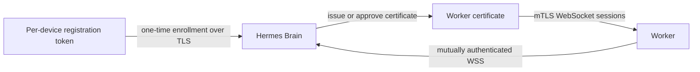

# ADR-009: Worker Enrollment and mTLS Migration

## Status

Accepted

## Date

19.07.2026

---

## Context

[[ADR-008-Worker-Communication-Model|ADR-008]] Worker'ların Hermes Brain'e
pull-based WebSocket bağlantısı kuracağını belirler; ancak Worker kimlik
doğrulama yöntemi tanımlanmamıştı. İlk prototipin kurulumu kolay olmalı, fakat
uzun vadede tek bir sızmış token tüm bir cihazın kimliği olmamalıdır.

## Decision

İlk uygulamada her fiziksel cihaz için benzersiz, süreli ve tek kullanımlık bir
**registration token** kullanılacaktır.

- Token, Worker'ın ilk kayıt isteğinde TLS üzerinden gönderilir.
- Token yalnızca yeni Worker kaydı için geçerlidir; Brain kullanımdan sonra
  token'ı geçersiz kılar.
- Token kaynak koda, `config/worker.example.conf` dosyasına veya Git'e
  yazılmaz; gerçek değer `secrets/` altında yerel olarak tutulur.
- Brain her token'ı bir Worker kimliği ve rolüyle ilişkilendirerek denetim kaydı
  oluşturur.

## Migration Target

Üretim seviyesine geçmeden önce Worker bağlantıları mTLS sertifikalarına
taşınacaktır.

Bu geçişte token yalnızca sertifika yenileme/kayıt akışında kalabilir; normal
Worker oturumları token ile yetkilendirilmez.

## Consequences

- İlk WebSocket istemcisi düşük operasyonel maliyetle geliştirilebilir.
- Token üretimi, süre sonu ve iptali Brain tarafında uygulanmalıdır.
- Token sızıntısı riski kısa ömür ve tek kullanım ile sınırlanır; yine de
  mTLS'e geçiş bu ilk yaklaşımın güvenlik sınırıdır.
- Worker Protocol, kayıt ve sertifika yaşam döngüsü mesajları eklendiğinde yeni
  bir sürümle genişletilmelidir.

## Related Documents

- [[ADR-008-Worker-Communication-Model|Worker Communication Model]]
- [[09-Worker-Protocol|Worker Protocol v1]]
- [[07-AI-Handoff|AI Handoff]]
